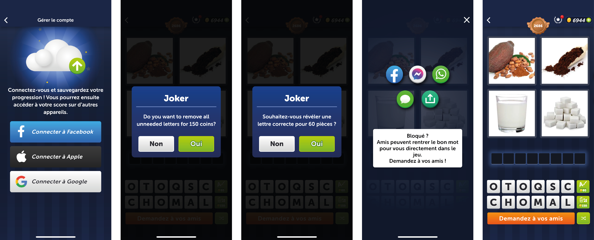
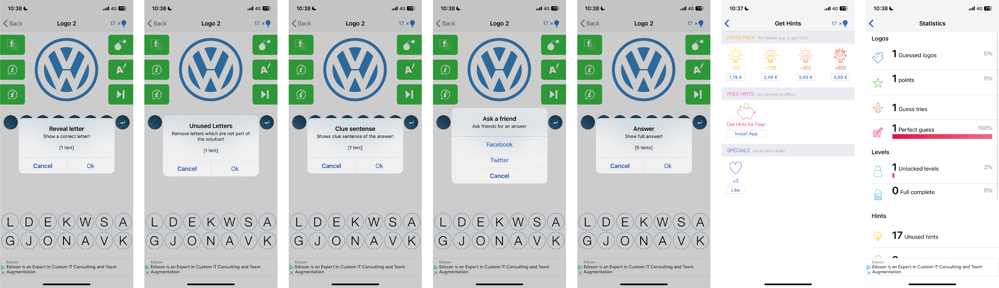
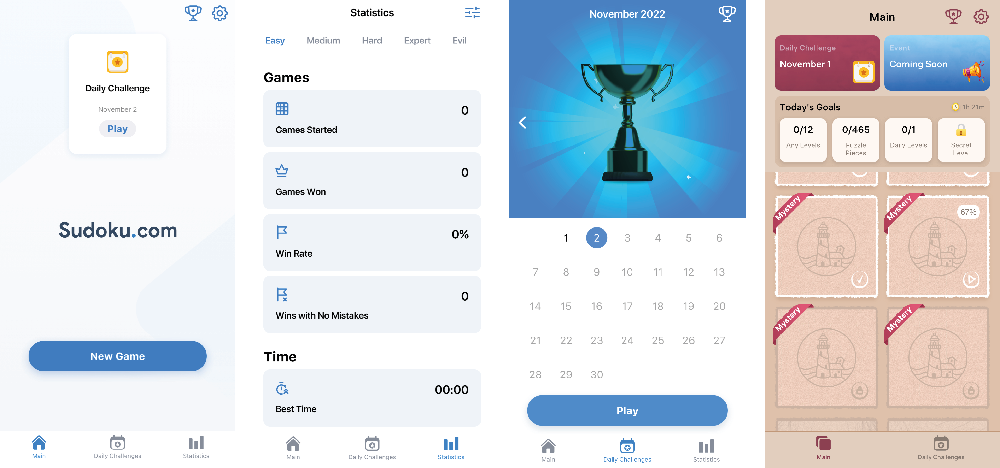
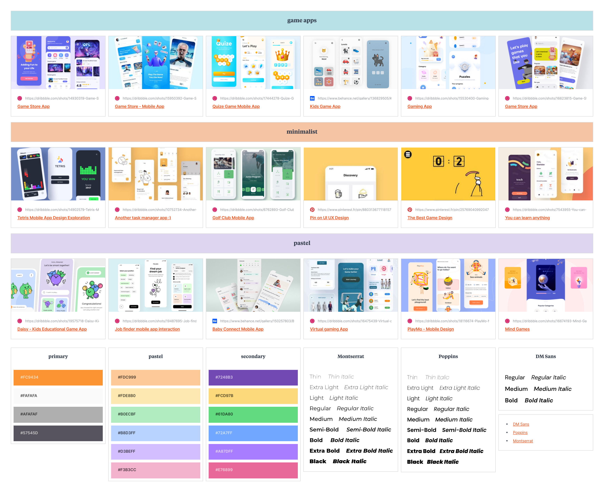

# 4 Images 1 Mot

> ❗❗❗  
> Malheureusement, le code source ne fonctionne plus depuis que j'ai migré les fichiers sur ce nouveau repo. J'essaierai de le réparer un jour mais il est actuellement injouable si vous veniez à télécharger le code. 
> ❗❗❗

### ✏️ Description de l'application

**4 Images 1 Mot** est un jeu très simple de réflexion dans lequel le joueur doit trouver un mot à partir de 4 images
liées à ce mot, chaque mot trouvé se retrouve dans un glossaire accompagné d'une définition. En plus du mode normal,
l'utilisateur a aussi accès à 3 challenges :

- **timer** : le but est de trouver le plus de mots dans un temps choisis entre 30 secondes, 1 minute et 1 minute 30
- **moins d'images** : le but est de trouver les mots avec un nombre réduit d'images, choisis entre 1, 2 ou 3 images
- **daily** : chaque jour, un nouveau mot autour d'un thème qui change mensuellement sont disponibles (présenté sous
  forme de calendrier), avec possibilité de rejouer les mots manqués

S'il est bloqué, l'utilisateur peut utiliser 6 types de jokers :

- révéler une lettre à un endroit choisi
- retirer toutes les lettres inutiles
- passer un mot
- pour le **mode normal**, afficher la définition du mot
- pour le challenge **moins d'images**, révéler une image jusqu'à avoir les 4
- pour le challenge **timer**, ajouter 10 secondes au time

Pour obtenir des jokers, le joueur peut soit les acheter avec des pièces qu'il gagne après chaque niveau, ou il peut
aussi parfois gagner des jokers après avoir réussi un des challenges.

Le joueur peut aussi partager le mot sur différents réseaux afin de demander de l'aide.

Afin de sauvegarder et synchroniser sa progression sur différent appareil, l'utilisateur peut également se connecter
via Google, Facebook, ou Apple.

---

### 📚 Étude de l'existant

> Il existe beaucoup d'autres jeux avec exactement le même concept et les mêmes fonctionnalités que le 4 Images 1 Mot
> original et je ne vais donc pas tous les listés ci-dessous. J'ai préféré reprendre des jeux avec un concept qui s'y
> rapproche, mais dont les fonctionnalités sont relativement différentes.

- **4 Pics 1 Word** (original) : 4 Pics 1 Word est un jeu de puzzle de mots créé par LOTUM GmbH. Chaque niveau affiche
  quatre images liées par un mot - le but du joueur est de déterminer ce qu'est le mot, à partir d'un ensemble de
  lettres données sous les images. On dit que le jeu suit le modèle freemium : bien que le jeu soit gratuit, des
  microtransactions sont disponibles pour aider l'utilisateur à progresser plus rapidement dans le
  jeu. ([source](https://en.wikipedia.org/wiki/4_Pics_1_Word))

| points forts                                                                                  | points faibles                                                                                    |
| --------------------------------------------------------------------------------------------- | ------------------------------------------------------------------------------------------------- |
| ✅ - possibilité de sauvegarder la progression                                                | ❌ - impossible de savoir ce que certains mots signifient                                         |
| ✅ - partager le mot pour demander de l'aide                                                  | ❌ - on ne peut pas utiliser de joker si on a pas assez de monnaie                                |
| ✅ - on peut utiliser le joker directement avec la monnaie du jeu (pas besoin de vrai argent) | ❌ - impossible de rejouer les mots du jour manqués ou même de se "balader" dans les anciens mots |

- **Logo Quiz - Guess the brands !** : Logo Quiz est un jeu gratuit dans lequel vous devez deviner les noms de milliers
  de logos d'entreprises
  populaires. ([source](https://www.logos-quiz.com/home.php#:~:text=Logo%20Quiz%20is%20a%20free%20game%20where%20you%20guess%20the%20names%20of%20thousands%20of%20logos%20from%20popular%20companies.))

| points forts                                 | points faibles                                           |
| -------------------------------------------- | -------------------------------------------------------- |
| ✅ - les jokers sont stockés en nombre       | ❌ - le seul moyen d'obtenir des joker est d'en gagner   |
| ✅ - joker pour passer le niveau             | ❌ - les jokers doivent être achetés avec du vrai argent |
| ✅ - joker qui donne la définition du logo   |                                                          |
| ✅ - partager le mot pour demander de l'aide |                                                          |

- **Art Puzzle** et **Sudoku.com - Number Game** : Ces deux jeux proviennent du même développeur, je les ai choisis car
  je trouve que leur structure est intéressante et corresponde exactement à ce que je recherche

| points forts                                  | points faibles                                         |
| --------------------------------------------- | ------------------------------------------------------ |
| ✅ - les jokers sont stockés en nombre        | ❌ - le seul moyen d'obtenir des joker est d'en gagner |
| ✅ - daily challenge sous forme de calendrier |                                                        |

---

### 🌙 Moodboard

- [lien vers Milanote](https://app.milanote.com/1OPVCi1Q5TBr6x?p=EeG9jqEU1UN)

---

### 🎨 Design

- [lien vers le fichier](readme/design.fig)
- [lien vers Figma](https://www.figma.com/file/Syhq3rBQKENqUOtCfV8zKM/4-Pics-1-Word?node-id=0%3A1)

---

### ⚙️ Fonctionnalités de l'application

> En plus des challenges disponibles, voici les fonctionnalités principales de l'application.

- En tant qu'**utilisateur**, je veux pouvoir **me connecter** afin de pouvoir **sauvegarder ma progression à travers
  différents appareils**.
- En tant qu'**utilisateur**, je veux pouvoir **accéder au glossaire** afin de pouvoir **comprendre les termes que je
  viens de trouver**.
- En tant qu'**utilisateur**, je veux pouvoir **avoir l'aide de joker** afin de pouvoir **avancer dans les niveaux où je
  suis bloqué**.

---

### 📂 FICHIERS

Les images et GIF utilisés dans ce README se trouvent dans le dossier [readme](readme).

Le projet Flutter se trouve dans le dossier [`app`](app).

Le dossier [`assets`](app/assets) comporte toutes les resources nécessaires à l'application telles que
les [fichiers de polices](app/assets/fonts), les [icônes](app/assets/icons), les [images](app/assets/img) et un fichier [json](app/assets/sources/words.json) contenant tous les mots afin de facilement les importés dans Firebase.

Le dossier [`lib`](app/lib) contient tous les fichiers nécessaires au fonctionnement de l'application :

- [`styles`](app/lib/styles) : contient un fichier [`constants.dart`](app/lib/styles/constants.dart) dans lequel sont
  définies toutes les constantes de couleurs, styles de textes et valeurs dont j'ai besoin (et temporairement un fichier
  de preview de ces styles appelé [`styles_preview.dart`](app/lib/styles/styles_preview.dart))
- [`models`](app/lib/models) : contient les différents modèles de l'application
- [`screens`](app/lib/screens) : contient les différents fichiers d'écrans
- [`partials`](app/lib/partials) : contient tous les widgets que j'ai créés, chacun rassemblés dans des sous-dossiers
  correspondant à leur fonction

---

### 💡 TODO

##### Général

- [x] créer les screens principaux
- [ ] créer les screens d'overlays
- [x] lier les écrans entre eux
- [x] afficher la grille d'image
- [x] mettre en place Firebase
- [x] mettre en place LocalStorage

##### Niveau

- [x] permettre de zoomer une image au clic
- [x] créer une classe `Word` avec ses propriétés
- [x] créer une classe `Letter` avec ses propriétés
- [x] générer le tableau de lettres disponibles
- [x] sélectionner une lettre et l'ajouter/la retirer des lettres sélectionnées
- [ ] garder un mémoire la position d'une lettre sélectionnée lorsqu'elle est retirée
- [x] valider le mot

##### Glossaire

- [x] afficher la liste des mots trouvés dans le glossaire
- [x] afficher les informations d'un mot du glossaire
- [ ] partager un mot deviné

##### Challenges

- [ ] créer une classe abstraite `Challenge` avec les propriétés communes

###### Daily Word :

- [ ] calendrier
- [ ] naviguer entre les mois et jouer aux mots manqués

###### Timer :

- [ ] créer une classe `Timer` avec ses propriétés
- [ ] permettre de choisir le temps
- [ ] lancer et arrêter le timer
- [ ] gérer le nombre d'images trouvées dans le temps imparti

###### Moins d'images :

- [ ] créer une classe `LessImage` avec ses propriétés
- [ ] permettre de choisir le nombre d'images

##### Indices

- [ ] créer une classe `Hint` avec ses propriétés
- [ ] gérer la fonction de chaque indice :
  - [ ] révéler une lettre à l'endroit choisi
  - [ ] retirer les lettres inutiles
  - [ ] passer un mot
  - [ ] afficher la définition
  - [ ] ajouter 10 secondes au timer
  - [ ] ajouter une image
  - [ ] demander de l'aide à un ami

---

### 📎 Ressources

- [liste du glossaire](https://www.youtube.com/watch?v=mGgizUoyeYY)
- [overlay](https://blog.logrocket.com/complete-guide-implementing-overlays-flutter/#example-1-displaying-an-error-message-on-a-sign-up-screen)
